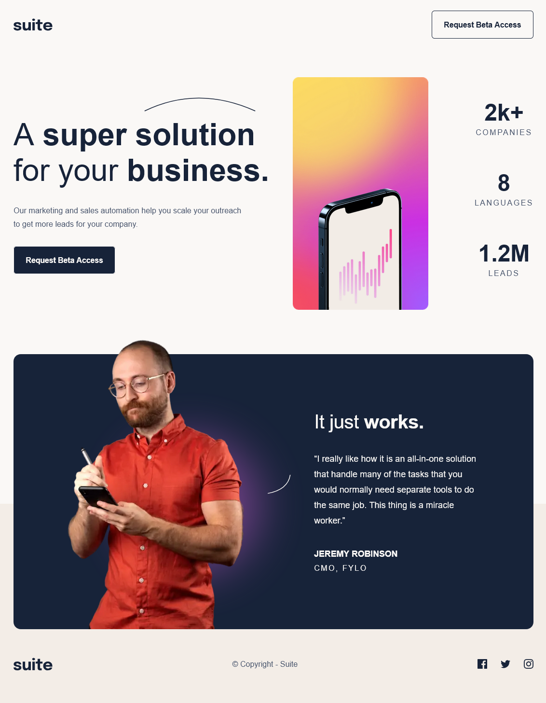

<!-- @format -->

# Frontend Mentor - Suite landing page solution

This is a solution to the [Suite landing page challenge on Frontend Mentor](https://www.frontendmentor.io/challenges/suite-landing-page-tj_eaU-Ra). Frontend Mentor challenges help you improve your coding skills by building realistic projects.

## Table of contents

- [Overview](#overview)
  - [The challenge](#the-challenge)
  - [Screenshot](#screenshot)
  - [Links](#links)
- [My process](#my-process)
  - [Built with](#built-with)
  - [What I learned](#what-i-learned)
  - [Continued development](#continued-development)
  - [Useful resources](#useful-resources)
- [Author](#author)
- [Acknowledgments](#acknowledgments)

**Note: Delete this note and update the table of contents based on what sections you keep.**

## Overview

### The challenge

Users should be able to:

- View the optimal layout depending on their device's screen size
- See hover states for interactive elements

### Screenshot

### Links

- Solution URL: [Add solution URL here](https://your-solution-url.com)
- Live Site URL: [Add live site URL here](https://your-live-site-url.com)

## My process

### Built with

- Semantic HTML5 markup
- Flexbox
- Mobile-first workflow
- [React](https://react.dev/) - JS library
- [Next.js](https://nextjs.org/) - React framework
- [Tailwind](https://tailwindcss.com/) - For styles

### Continued development

I would like to continue using Next.js together with Tailwind until I'm getting comfortable with these tools.

### Useful resources

- [Name that color](https://chir.ag/projects/name-that-color/#6195ED)
- [Creating High-Quality React Components: Best Practices for Reusability](https://www.youtube.com/watch?v=eXRlVpw1SIQ)
- [Tru Narla: Building a design system in Next.js with Tailwind](https://www.youtube.com/watch?v=T-Zv73yZ_QI&t=427s)
- [“Everything Developers Need To Know About Figma” article on Smashing Magazine](https://www.smashingmagazine.com/2020/09/figma-developers-guide/)
- ["Introduction to Figma for Developers" video with Ryan Warner and Jason Lengstorf on Learn with Jason](https://www.learnwithjason.dev/introduction-to-figma-for-developers)

## Author

- Frontend Mentor - [@luAr26](https://www.frontendmentor.io/profile/luAr26)
